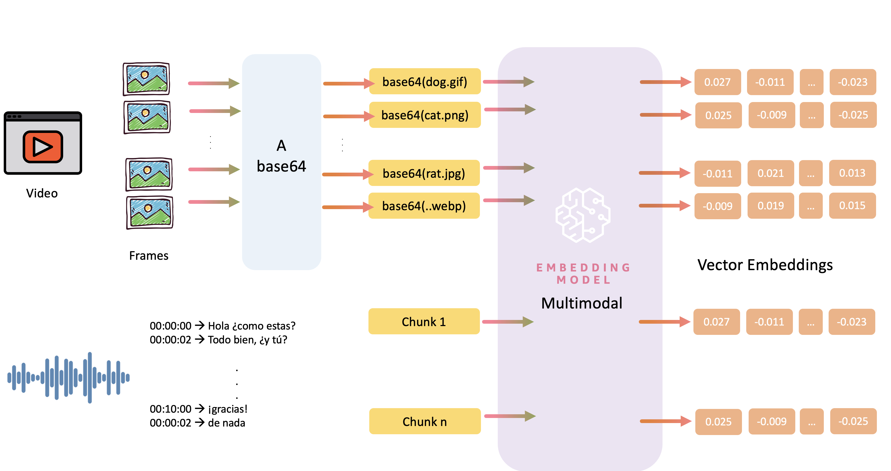
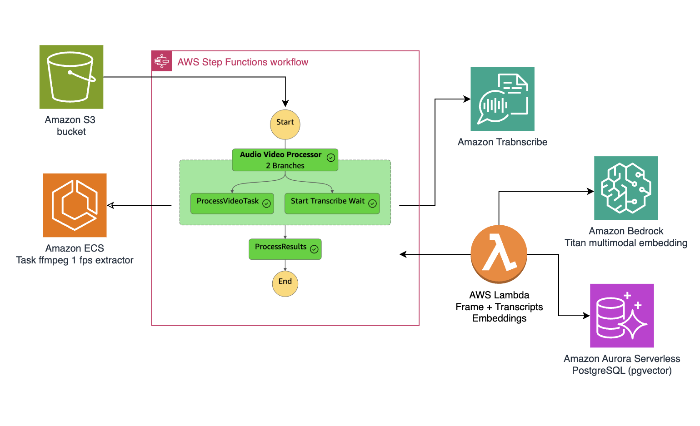

# Ask Your Video: Audio/Video Processing Pipeline with Vector Search

> This documentation was created with the help of [Generating documentation with Amazon Q Developer](https://docs.aws.amazon.com/amazonq/latest/qdeveloper-ug/doc-generation.html)

Build a serverless solution that processes video content and makes it searchable using natural language. This solution extracts meaningful information from both audio and video, allowing you to find specific moments using simple queries. The app stores all vector information in Amazon Aurora PostgreSQL with pgvector, enabling combined semantic searches across visual and audio content. This project uses three AWS CDK stacks to create a complete video processing and search solution.




### What You'll Build

Built this app with [AWS Cloud Development Kit (CDK)](https://aws.amazon.com/cdk) to create a serverless architecture that:
- Processes both audio and video elements
- Extracts transcripts and key frames
- Generates searchable embeddings
- Creates a vector database for natural language queries

This project implements a scalable and modular architecture for processing audio/video content using
[Amazon Elastic Container Service (ECS)](https://aws.amazon.com/ecs/) to handles compute-intensive video processing, [Amazon Aurora PostgreSQL](https://docs.aws.amazon.com/AmazonRDS/latest/AuroraUserGuide/Aurora.AuroraPostgreSQL.html) with pgvector to stores vectors and enables similarity search, [Amazon Transcribe](https://aws.amazon.com/transcribe/), and [AWS Step Functions](https://aws.amazon.com/step-functions/) for workflow management.



The workflow begins when you upload a video to an Amazon S3 bucket, which triggers an AWS Step Functions workflow that orchestrates parallel processing streams.

The architecture splits into two main processing branches that work simultaneously:

1. **Visual Processing Pipeline:** Video → Frame extraction → Image embeddings
- Uses an Amazon ECS task running FFmpeg to extract frames at 1 FPS
- Processes these frames through Amazon Bedrock's Titan multimodal model to generate image embeddings

2. **Audio Processing Pipeline:** Audio → Transcribe → Text Chunks → Embeddings
- Employs Amazon Transcribe to convert speech to text
- Segments the transcribed text semantically while maintaining temporal context

An AWS Lambda function serves as the convergence point, processing both the extracted frames and transcriptions to generate the corresponding embeddings. All this vectorized information is then stored in Amazon Aurora Serverless PostgreSQL using pgvector, enabling combined semantic searches of visual and audio content.

## 💰 Cost
- [Amazon Bedrock Pricing](https://aws.amazon.com/bedrock/pricing/)
- [AWS Lambda Pricing](https://aws.amazon.com/lambda/pricing/)
- [Amazon Aurora Pricing](https://aws.amazon.com/rds/aurora/pricing/)
- [Amazon S3 Pricing](https://aws.amazon.com/s3/pricing/)


## App Structure
```
.
├── 01-ecs-cluster/                  # ECS cluster infrastructure
├── 02-aurora-pg-vector/            # Aurora PostgreSQL with pgvector setup
│   ├── aurora_postgres/            # Aurora database configuration
│   └── lambdas/                    # Database initialization Lambda functions
└── 03-audio-video-workflow/        # Main processing pipeline
    ├── container/                  # Docker container for video processing
    ├── databases/                  # Database interaction layer
    ├── lambdas/                    # Lambda functions for pipeline steps
    │   └── code/                   # Lambda function implementations
    └── workflows/                  # Step Functions workflow definitions
```


### 🚀 Let's build!

1. Clone the repository:

✅ Clone the repo
```bash
git clone https://github.com/build-on-aws/langchain-embeddings
```
✅ Go to: 

```
cd create-audio-video-embeddings
```

2. APP Set Up:

✅ Create The Virtual Environment: by following the steps in the [README](/01-ecs-cluster/README.md)

```bash
python3 -m venv .venv
```

```bash
source .venv/bin/activate
```
for windows: 

```bash
.venv\Scripts\activate.bat
```

✅ Install dependencies:

```bash
pip install -r requirements.txt
```

✅ Synthesize The Cloudformation Template With The Following Command:

```bash
cdk synth
```

3. Deploy the infrastructure stacks:

Deploy Amazon ECS cluster

```bash
cd 01-ecs-cluster
cdk deploy
```

Deploy Amazon Aurora PostgreSQL
```bash
cd ../02-aurora-pg-vector
cdk deploy
```

Deploy AWS Step Funtion workflow 
```bash
cd ../03-audio-video-workflow
cdk deploy
```

Deploy retrieval workflow 
```bash
cd ../04-retrieval
cdk deploy
```

### Test the App 
✅  Go to the test environment

```bash
cd ../04-etrieval/test-retrival/
```

1. Upload a video file to the input S3 bucket:
```bash
aws s3 cp your-video.mp4 s3://your-input-bucket/
```

2. The pipeline will automatically:
- Extract audio and start transcription
- Process video frames and generate embeddings
- Store results in Aurora PostgreSQL

3. Query the results using the provided SQL functions:

✅ Go to the notebobok [01_query_audio_video_embeddings.ipynb](./04-etrieval/test-retrival/01_query_audio_video_embeddings.ipynb)

✅ Try the API [02_test_webook.ipynb](./04-etrieval/test-retrival/02_test_webook.ipynb)

----

## 🇻🇪🇨🇱 ¡Gracias!

---

## Security

See [CONTRIBUTING](CONTRIBUTING.md#security-issue-notifications) for more information.

## License

This library is licensed under the MIT-0 License. See the LICENSE file.